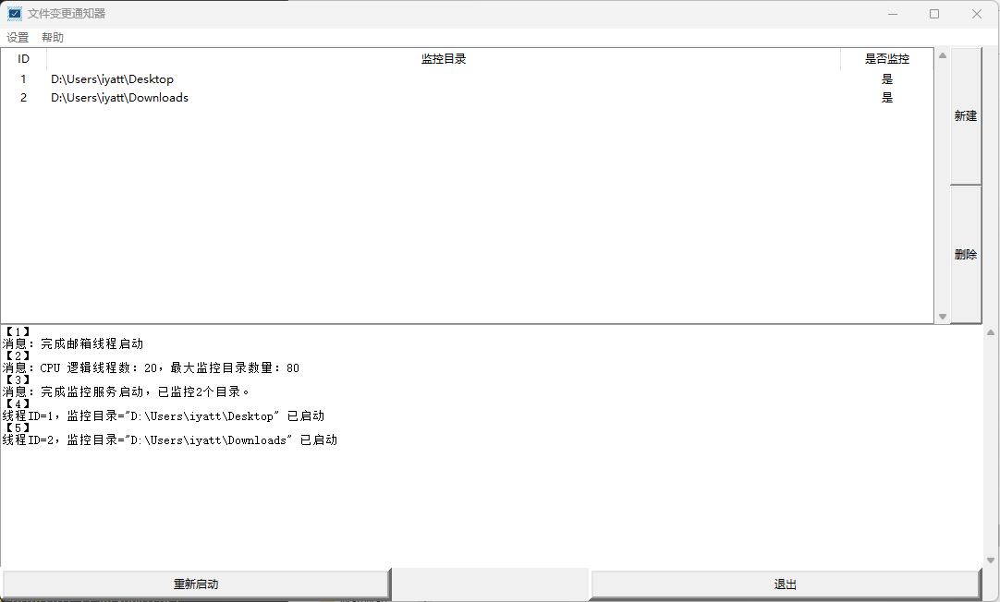
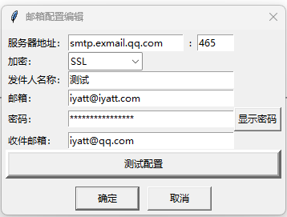

# file-notifier 文件变更通知器

20250615  
最开始有想法写这样一个小工具是一个月前了，当时我在跟的一个产品在推动量产，我需要及时得知工人送检三坐标的情况，需要一个工具监控三坐标电脑共享的报告保存目录，这样只要保存了报告文件，我就可以知道送检了，便于及时查看尺寸检测情况。当时没找到合适的工具，有想法自己写一个，结果忙起来就搁置了。  
这个周我又想起来了，每天下班抽一点时间写一下，大概框架搭建好后，周末测试完善出成品。

## 测试环境

* Windows 11 24H2
* Python 3.13.1（要求 Windows 8 及以上）

## 使用

视频演示：https://www.bilibili.com/video/BV1KbM4zoEyP

1.首次使用需要配置邮箱，在`设置`->`邮箱配置`中进行配置，设置发件邮箱信息和收件地址；  
  
2.通过`新建`添加新的监控目录，双击已有的监控目录可以编辑，选中监控目录点`删除`或按`Delete`键可以删除监控目录；  
3.修改邮箱配置或增删改监控目录后，需要点击`重新启动`生效。  
4.在`设置`中勾选`开机自启动`可以添加开机自启动。  